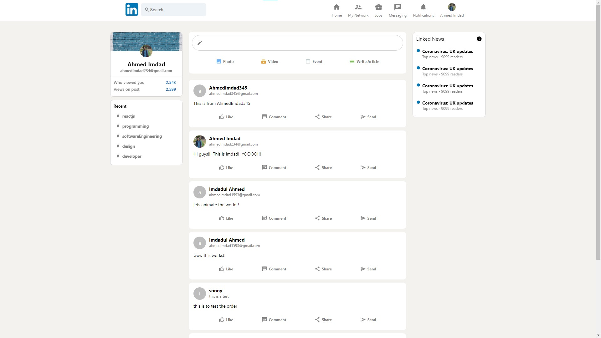

#  A LinkedIn Clone built with React and Redux 

## Table of contents

- [Overview](#overview)
  - [The challenge](#the-challenge)
  - [Screenshot](#screenshot)
  - [Links](#links)
- [My process](#my-process)
  - [Built with](#built-with)
- [Author](#author)
- [Acknowledgments](#acknowledgments)

## Overview

- This is a linkedIn clone built with React and Redux which uses Firebase for authentication, hosting and many more!

### The challenge

- Learnt a lot using Redux and Firebase. Hope to integrate some other functionalities in the future.

### Screenshot

### Links

- Solution URL: [solution](https://github.com/imdadulahmed1593/quiz-for-you-react-typescript)
- Live Site URL: [live link](https://linkedin-clone-react-68ffd.web.app/)

## My process

### Built with

- Redux
- ReactJS
- Firebase

## Author

- Website - [Ahmed Imdad](https://ahmedimdad93.netlify.app/)
- Frontend Mentor - [Ahmed Imdad](https://www.frontendmentor.io/profile/imdadulahmed1593)
- Facebook- [Ahmed Imdad](https://www.facebook.com/ahmed.imdad.5/)

## Acknowledgments

I would like to acknowledge myself for this amazing project :v
